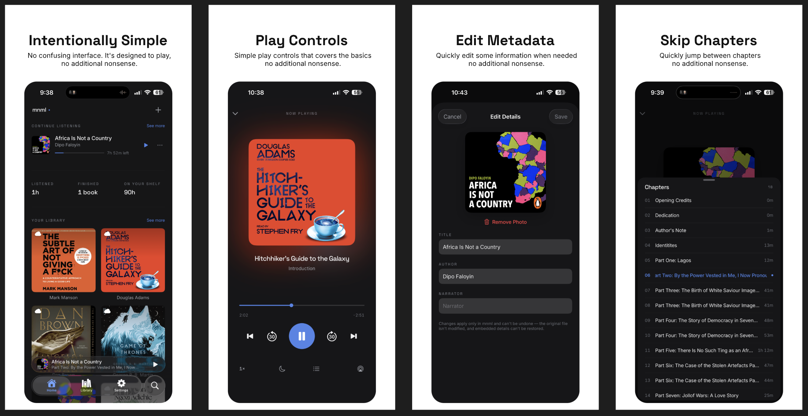

<div align="center">

<picture>
  <source media="(prefers-color-scheme: dark)" srcset="assets/mnml-light.svg">
  <source media="(prefers-color-scheme: light)" srcset="assets/mnml-dark.svg">
  
</picture>

### A minimalist audiobook player for iOS, iPadOS & macOS

Built with SwiftUI · SwiftData · CloudKit

[](#requirements)
[](https://swift.org)
[](LICENSE)

</div>

---

**mnml** is a quiet, focused audiobook player. Drop in your `.m4b` / `.m4a` files and it pulls out the cover, chapters, author, and duration, then gets out of the way. Your library and listening progress sync privately across your devices through your own iCloud — no accounts, no servers, no tracking.

<div align="center">
  
</div>

## Features

**Library & import**
- Import single files, whole folders (scanned recursively), the Files-app `Inbox`, or an iCloud `Import/` folder
- Extracts title, author, cover art, duration, and native chapter metadata via AVFoundation
- Duplicate detection, orphan cleanup, and safe local → iCloud migration
- Sort, group, filter, search (diacritic-insensitive), grid/list layouts, multi-select delete
- Edit book details — title, author, narrator, cover photo, and tint

**Playback**
- Tap/drag seek with a chapter-relative scrubber, skip back 15s / forward 30s
- Per-book playback speed (0.8×–2×) and chapter navigation
- **Smart Rewind** — rewinds on resume, scaled to how long you were away
- Sleep timer, resume-on-launch, and lifetime listening stats
- Lock screen, Control Center, and AirPlay support
- Mini player + full Now Playing view with breathing cover and marquee titles

**iCloud sync & storage**
- Optional library + progress sync over CloudKit, with files in your iCloud Drive container
- Live transfer badges (synced / uploading / downloading / cloud-only), on-demand download, and *Free Up Space*

**Settings & design**
- System / Light / Dark appearance, English + German localization
- A custom design system: Space Grotesk + Inter, dynamic color tokens, haptics, responsive grid

## Requirements

- iOS / iPadOS **26.0+** (uses Liquid Glass `tabViewBottomAccessory`)
- Xcode 26+
- An iCloud account on the device for sync features

## Getting started

```bash
git clone git@github.com:neoighodaro/mnml.git
cd mnml
open mnml.xcodeproj
```

1. Select your development team under **Signing & Capabilities** for the `mnml` and `mnmlWidgets` targets.
2. Update the bundle identifiers (currently `com.tapsharp.mnml`) and the iCloud container to your own.
3. Build and run on a device or simulator running iOS 26+.

> [!NOTE]
> The entitlements ship with `aps-environment: development`. Switch this to `production` before TestFlight or App Store submission.

## Project layout

```
mnml/            App source — playback, library, import, sync, settings, design system
mnmlWidgets/     Home Screen / Lock Screen widget extension
mnmlTests/       Swift Testing unit tests
assets/          Logo, icon, and screenshots
```

## Testing

The test suite uses **Swift Testing**. Run it from Xcode (`⌘U`) or via:

```bash
xcodebuild test -project mnml.xcodeproj -scheme mnml -destination 'platform=iOS Simulator,name=iPhone 16'
```

## License

Released under the [MIT License](LICENSE).
